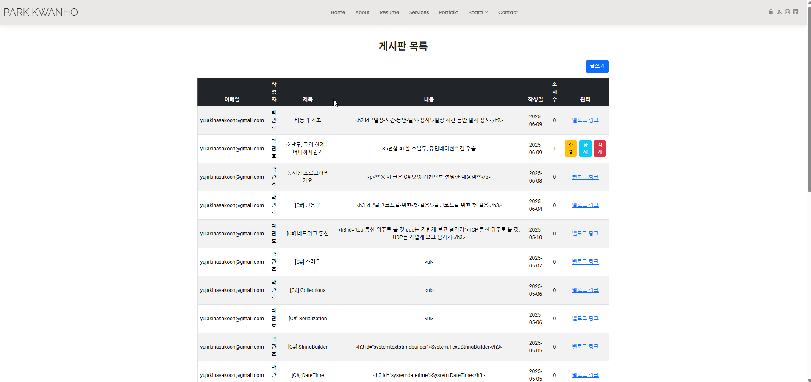
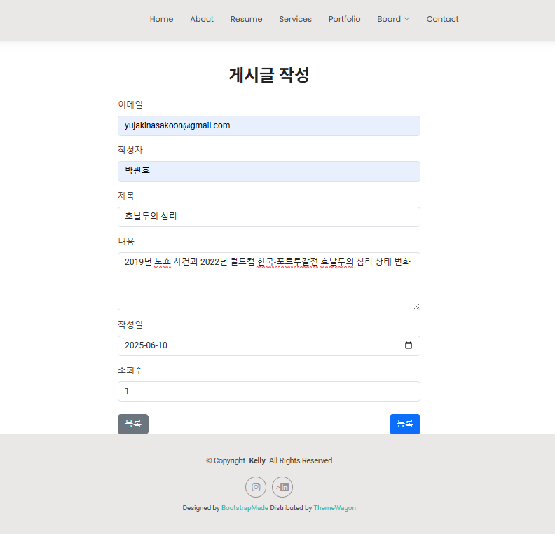
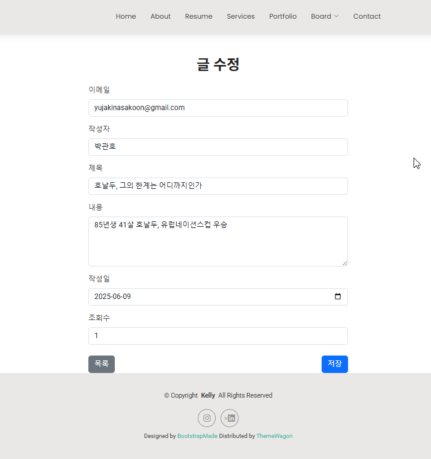
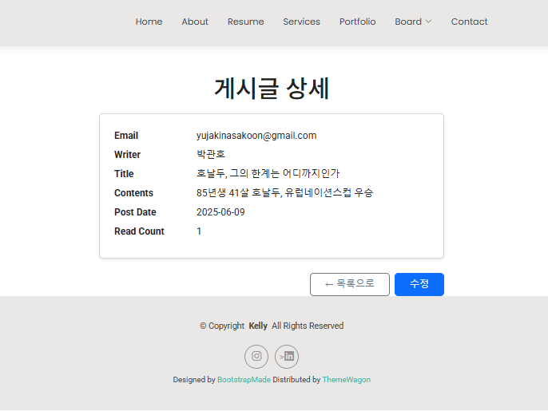
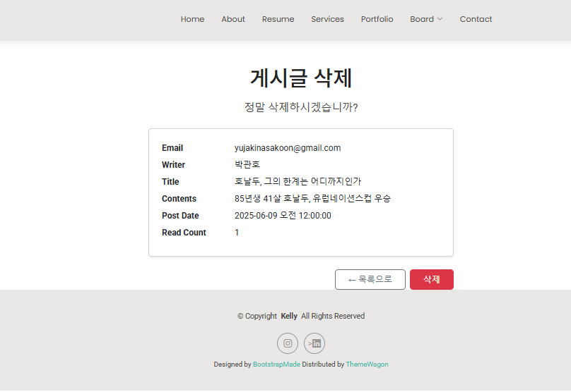
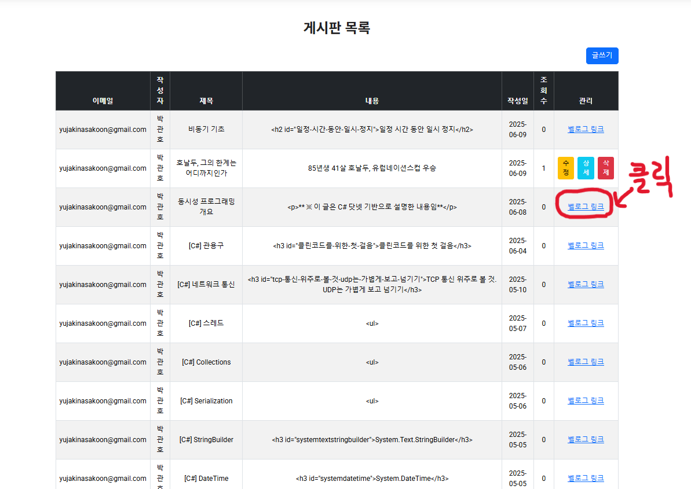
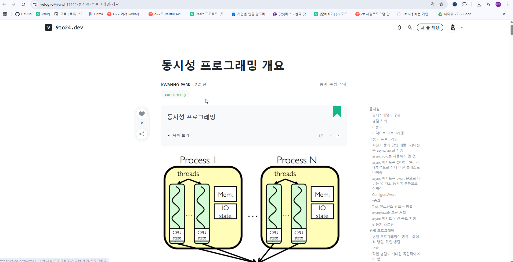

# Toy_Projects
## 토이프로젝트 모음 리포지토리

***

## 📝 개인 포트폴리오 사이트 게시판 - [소스](https://github.com/talCSHN/IoT_WebApp_2025/tree/main/day10/Day10Study)

#### 기술 스택
- C# ASP.NET
- MySQL

#### 설명
- 포트폴리오 웹 사이트 내 게시판 페이지
- 해당 페이지에서 게시글 **조회/추가/수정/삭제** 가능
- **Velog RSS**를 통해 실제 내 벨로그 게시글 연동 - [Velog 링크](https://velog.io/@wwh11111/posts)

##### 글쓰기

##### 수정

##### 상세

##### 삭제

##### 벨로그 게시물은 링크를 통해 상세 내용 확인(수정 및 삭제 불가)

아래 velog 실제글로 이동

***

## 👑 보물찾기 게임 - [소스](https://github.com/talCSHN/IoT_CSharp_WinApp_2025/tree/main/toyproject/WinFormPractice)

#### 기술스택
- C# .NET WinForms

#### 게임 설명
- 10x10 그리드에 100개 버튼 생성
- 매번 랜덤 위치에 보물 생성
- 시작 시 **10초** 타이머 작동. 하단 Progress bar에 시간 경과 표시
- **버튼 클릭 시**
    - ❌ : 보물이 아닌 버튼 클릭. 게임 종료까지 해당 버튼 비활성화

    - 👑 : 보물이 있는 버튼 클릭. `보물 발견` 메시지 출력
- **승리 조건** - 보물이 있는 버튼 👑 발견
  - 제한 시간(10초)내 보물 찾지 못하면 `실패` 메시지 출력. `게임 종료`
- `게임 승리` 또는 `게임 종료`되면 자동으로 게임 리셋 후 새 게임 진행

***

<!-- ## 영화 즐겨찾기 앱 - [소스](https://github.com/talCSHN/IoT_WPF_2025/tree/main/day06/Day06Study)

https://github.com/user-attachments/assets/4de78572-386d-4700-b545-58f491fd1621

#### 기술스택
- C# .NET WPF

#### 프로그램 설명 -->